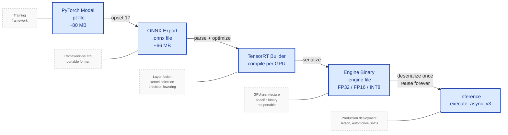

# Monocular Depth Estimation Pipeline

> Per-pixel depth estimation from traffic video using transformer-based models —
> with multi-model benchmarking, YOLO detection overlay, **TensorRT deployment with FP32/FP16/INT8 quantization**, and ONNX export.


---

## Demo

<div align="center">


*Depth colormap with YOLO detections — each vehicle annotated with class, confidence, and estimated depth value.
Running at 15+ FPS on a GTX 1650.*

</div>

---

## What This Project Does

A single camera frame contains no explicit depth information — objects close and far project
onto the same 2D plane. This pipeline recovers per-pixel relative depth from monocular video
using transformer-based models, combines that depth with real-time object detection, and
**deploys the model through TensorRT with FP16 and INT8 quantization** — the same path used
in production embedded perception on automotive SoCs and robotics platforms.

Five outputs are produced per run:

| Output | Description |
|---|---|
| `depth_video.mp4` | Colorized depth map video — warm pixels near, cool pixels far |
| `overlay_video.mp4` | Depth map with YOLO bounding boxes and per-vehicle depth values |
| `profiler_log.csv` | Per-frame inference time and FPS log |
| `outputs/midas_small_*.engine` | TensorRT engines in FP32, FP16, INT8 precision |
| `outputs/midas_small_int8.cache` | INT8 calibration data for reproducible quantization |

---

## Input → Depth Map → Detection Overlay

<div align="center">

| Raw input | Depth map | Detection overlay |
|:---:|:---:|:---:|
|  |  |  |
| Original traffic video frame | Per-pixel relative depth (INFERNO colormap) | Depth + YOLO boxes with depth value per vehicle |

</div>

---

## Pipeline Architecture

<div align="center">


*Two-branch pipeline — depth estimation and object detection run on each frame,
results merge in the annotator to produce the final output.*

</div>

---

## How It Works — Technical Overview

### Monocular depth estimation

A single RGB image is geometrically ambiguous — the same 2D projection can come from
infinitely many 3D scenes. A small nearby object and a large distant object cast identical
pixel footprints. Monocular depth models resolve this ambiguity by learning statistical
priors from large datasets: objects lower in the frame tend to be closer, texture becomes
finer with distance, and known object categories (cars, people) provide implicit scale cues.

The output is **relative depth** — a per-pixel map encoding which surfaces are nearer or
farther relative to each other, not absolute metric distance in metres. Metric depth requires
either stereo cameras, LiDAR ground truth, or scale anchoring from known object sizes.

### MiDaS architecture

MiDaS (Mixed Dataset for zero-shot relative depth) uses a **DPT (Dense Prediction
Transformer)** architecture. A Vision Transformer or EfficientNet backbone extracts
multi-scale feature representations, which a decoder assembles into a full-resolution depth
map. Crucially, MiDaS was trained across a diverse mix of datasets with different capture
setups — enabling zero-shot generalization to unseen scenes without fine-tuning.

The small variant uses an EfficientNet-Lite3 backbone (fast, ~80MB). The large variant uses
a ViT-Large backbone (slow, accurate, ~1.3GB). Both produce relative inverse depth — closer
surfaces have higher values, which maps naturally to the bright end of the INFERNO colormap.

### Depth Anything V2

Depth Anything V2 extends the MiDaS philosophy with a much larger and more diverse training
set including synthetic data with metric labels. The Small variant (~100MB) achieves notably
sharper depth boundaries than MiDaS Small — especially around object edges and thin
structures — at the cost of higher inference latency on GPU.

---

## Deployment Pipeline — PyTorch to TensorRT

The journey from a trained PyTorch model to a deployed inference engine on embedded hardware
goes through four distinct stages, each adding optimization or portability at the cost of
flexibility. Understanding this pipeline is the difference between "I trained a model" and
"I shipped a model."



*Deployment pipeline — each stage trades flexibility for speed and portability.
PyTorch is for training and research; ONNX is the portable handoff format; TensorRT
compiles to a GPU-specific binary that runs in production embedded perception.*

**PyTorch** is the research and training framework. It's flexible — you can change the model
on the fly, add layers, debug. That flexibility costs runtime speed: every operation goes
through Python, and PyTorch can't pre-plan because it doesn't know what you'll do next frame.
PyTorch is also a heavy dependency (~2GB) that automotive SoCs and embedded targets often
can't run.

**ONNX (Open Neural Network Exchange)** is a portable format — a standard way to describe
a neural network that any framework can produce or consume. Exporting from PyTorch freezes
the computation graph, removing the Python flexibility but enabling deployment in lightweight
runtimes that don't ship the whole training framework. ONNX is the lingua franca of model
deployment.

**TensorRT** is NVIDIA's GPU-specific inference compiler. Given an ONNX model, TensorRT
spends a few minutes analyzing your specific GPU, fusing layers (convolution + batch-norm +
activation become one kernel), trying multiple kernel implementations for each layer, and
picking the fastest combination. The output is an `.engine` file — a compiled binary tuned
to your exact GPU. Engines are not portable across GPU architectures: an engine built for a
GTX 1650 won't run on an RTX 4090, and vice versa.

**FP32 / FP16 / INT8 precision** controls how numbers are stored and computed inside the
engine. FP32 uses 32 bits per number (most precise, largest, slowest). FP16 uses 16 bits
(half the memory, faster on Tensor-Core hardware). INT8 uses 8-bit integers — smallest and
fastest, but requires *calibration*: running representative data through the model in FP32
to compute the scale factors that map float ranges to `[-128, 127]`. Production embedded
perception (Jetson Orin, TI TDA4VM, Qualcomm Ride) runs INT8 almost exclusively for power
and latency reasons.

In this project, MiDaS Small is exported from PyTorch to ONNX, then compiled into three
TensorRT engines (FP32 baseline, FP16, INT8 with custom entropy calibrator using 200 traffic
video frames). All five backends — PyTorch, ONNX Runtime, and the three TensorRT precisions —
are benchmarked on identical input.

---

## Model Benchmark — PyTorch Variants

All models benchmarked on GTX 1650 (4GB VRAM) at 1280×720 resolution.

| Model | Backend | Avg Inference | Avg FPS | Notes |
|---|---|---|---|---|
| MiDaS Small | PyTorch (CUDA) | 68 ms | 17.79 | Default — best speed |
| MiDaS Small | ONNX Runtime (CUDA) | 90 ms | 11.08 | Deployment-ready format |
| MiDaS Large | PyTorch (CUDA) | 564 ms | 1.77 | Highest accuracy |
| Depth Anything V2 | PyTorch (CUDA) | 243 ms | 4.11 | Best visual quality |
| Depth + YOLO overlay | PyTorch (CUDA) | 87 ms | 15.41 | Both models combined |

This compares **architectures** at the framework level. The next section compares
**deployment backends** for the same chosen architecture (MiDaS Small).

---

## TensorRT Deployment & Quantization Study

### Act 1 — Full pipeline benchmark

The five-backend benchmark runs every backend through the same 100 frames with identical
preprocessing, postprocessing, and timing methodology (`torch.cuda.synchronize()` for honest
GPU measurement). Same model, same hardware, same input — only the inference backend differs.

[DIAGRAM 2 — FULL PIPELINE BAR CHART]

**Full pipeline timing** (preprocessing + GPU inference + postprocessing):

| Backend | Avg (ms) | p50 (ms) | p95 (ms) | FPS | Speedup vs PyTorch |
|---|---|---|---|---|---|
| PyTorch | 225.95 | 222.12 | 275.84 | 4.43 | 1.00× |
| ONNX Runtime | 112.40 | 106.69 | 135.01 | 8.90 | 2.01× |
| TensorRT FP32 | 112.26 | 105.67 | 139.33 | 8.91 | 2.01× |
| TensorRT FP16 | 125.72 | 120.07 | 150.15 | 7.95 | 1.80× |
| TensorRT INT8 | 99.98 | 98.87 | 109.74 | 10.00 | 2.26× |

The numbers raised one obvious question: **why was FP16 slower than FP32?** Theory says
FP16 should be at least as fast as FP32 — half the memory traffic, often faster compute.
Three possibilities seemed plausible: hardware limitations (GTX 1650 lacks Tensor Cores),
TensorRT tactic selection issues on Turing, or a methodology problem in our benchmark.

Rather than speculating, I instrumented a focused measurement.

### Act 2 — Investigating the FP16 anomaly with CUDA Events

The full-pipeline timing measures wall-clock duration of the entire `predict()` call —
which includes CPU preprocessing (`cv2.cvtColor`, `cv2.resize`, NumPy normalization),
CPU→GPU transfer, GPU inference, GPU→CPU transfer, and CPU postprocessing. Of these,
**only one step is GPU work.**

To measure pure GPU inference, I wrote a separate diagnostic script that:

1. Pre-processes all 100 frames once and pushes them to GPU memory before any timing
2. Times **only** `context.execute_async_v3()` + stream synchronization
3. Uses `torch.cuda.Event` instead of `time.perf_counter` — CUDA Events are timestamps on
   the GPU's own clock, immune to CPU scheduling jitter and OS timer resolution

[DIAGRAM 3 — TIME BREAKDOWN STACKED BAR]

**GPU-only timing** (CUDA Events, identical input, identical engines):

| Backend | GPU-only avg | GPU-only p50 | GPU-only p95 |
|---|---|---|---|
| TensorRT FP32 | 6.18 ms | 5.74 ms | 7.39 ms |
| TensorRT FP16 | 4.12 ms | 4.08 ms | 4.44 ms |
| TensorRT INT8 | 2.76 ms | 2.70 ms | 3.10 ms |

**The actual GPU ordering is exactly what theory predicts.** FP16 is 1.50× faster than
FP32 at the GPU level. INT8 is 2.24× faster than FP32. Clean monotonic speedup as precision
drops, with tight tail latency variance (p95 within 20% of p50 for all three).

### What the original anomaly actually was

The CPU and PCIe portion of each frame takes roughly 105-120 ms on a GTX 1650 system.
The GPU inference itself takes 3-6 ms. **The GPU is doing 2-5% of the work; the CPU
preprocessing and memory transfers do the other 95-98%.** The 2 ms genuine GPU advantage
of FP16 is completely swamped by 10-15 ms of normal CPU jitter (NumPy contention, OS
scheduling, cache state). On a different run order or a different machine state, FP32
might "win" the full-pipeline benchmark instead — but neither result reflects the GPU.

The lesson generalizes beyond this project: **on small models, you can't measure GPU
performance with end-to-end wall-clock timing.** The GPU finishes before the CPU can feed
it the next frame. To compare GPU backends honestly, you have to use CUDA Events and time
only the GPU work.

### What this means for production deployment

If the goal is real-time perception on this hardware, **the bottleneck is the CPU pipeline,
not the model.** The GPU could theoretically run at 200+ FPS for INT8 (1000 / 2.76 ms);
the actual delivered FPS is 10. Closing that gap is what production embedded perception
engineering looks like:

- Move preprocessing to GPU (CUDA-based resize and ImageNet normalization)
- Use pinned host memory for faster CPU→GPU transfers
- Pipeline frames so CPU preprocessing for frame N+1 happens during GPU inference of frame N
- Skip CPU postprocessing entirely if the downstream consumer can use the GPU tensor directly

These are out of scope for this project but represent the next 10× speedup. On automotive
SoCs (Jetson Orin), the same pattern applies — GPU work is rarely the bottleneck once you
quantize to INT8; memory layout, transfer scheduling, and pipeline parallelism are.

### Engine sizes and quantization integrity

| Engine | Size | Compression vs FP32 |
|---|---|---|
| `midas_small_fp32.engine` | 93.6 MB | 1.00× |
| `midas_small_fp16.engine` | 50.7 MB | 1.85× |
| `midas_small_int8.engine` | 17.7 MB | 5.29× |

The 5.29× INT8 compression confirms quantization is genuinely applied (a model that silently
fell back to FP32 would not shrink). Visual sanity check on the depth output: INT8 results
are visually indistinguishable from FP32 — no degradation in scene structure, depth ordering,
or colormap distribution. The custom `IInt8EntropyCalibrator2` uses 200 evenly-spaced frames
from the deployment video, ensuring activation scales reflect the actual data distribution
the model will see.

---

## Key Concepts at a Glance

| Concept | What it means here |
|---|---|
| Relative depth | Per-pixel near/far ordering — not metric metres |
| Zero-shot generalization | MiDaS runs on unseen traffic scenes without fine-tuning |
| DPT architecture | Transformer encoder + dense decoder for full-resolution prediction |
| INFERNO colormap | Yellow = near, purple/black = far — perceptually uniform |
| ONNX Runtime | Lightweight inference engine for embedded and automotive targets |
| TensorRT | NVIDIA inference compiler — fuses layers, picks fastest kernels per GPU |
| INT8 calibration | Computing per-tensor scale factors from representative data to map float → int8 |
| CUDA Events | GPU-timeline timestamps for accurate GPU-only timing, immune to CPU jitter |
| Engine binary | GPU-architecture-specific compiled inference graph |

---

## Project Structure

```
monocular-depth-estimation/
│
├── src/
│   ├── depth_estimator.py            # MiDaS + Depth Anything V2 inference (PyTorch)
│   ├── onnx_estimator.py             # ONNX Runtime inference wrapper
│   ├── trt_estimator.py              # TensorRT inference wrapper (engine loader + execute)
│   ├── trt_builder.py                # ONNX → TensorRT engine builder (FP32 / FP16 / INT8)
│   ├── int8_calibrator.py            # IInt8EntropyCalibrator2 for INT8 quantization
│   ├── video_pipeline.py             # Frame-by-frame depth video pipeline
│   ├── overlay_pipeline.py           # Combined depth + YOLO detection pipeline
│   ├── detector.py                   # YOLOv8 detection wrapper
│   ├── annotator.py                  # Draw boxes, labels, depth values on frames
│   ├── profiler.py                   # Per-frame FPS and inference time logger
│   └── exporter.py                   # ONNX export utility
│
├── configs/
│   └── default.yaml                  # All settings — no hardcoded values
│
├── tests/
│   ├── test_depth_estimator.py
│   ├── test_annotator.py
│   ├── test_profiler.py
│   └── test_trt_estimator.py         # smoke tests for engine loading + inference
│
├── docs/                             # Pipeline diagrams, demo GIF, sample frames
├── outputs/                          # Generated videos, ONNX, engines, calibration cache
├── data/                             # Input video (gitignored)
│
├── run_depth.py                      # Main CLI — depth video and overlay
├── run_benchmark.py                  # PyTorch model variant benchmark
├── run_onnx.py                       # ONNX export + PyTorch vs ONNX comparison
├── run_trt_benchmark.py              # Five-backend full-pipeline benchmark
├── run_trt_gpu_only_benchmark.py     # Pure-GPU benchmark using CUDA Events
├── make_gif.py                       # Demo GIF generator
├── Dockerfile                        # Reproducible inference container
└── .github/workflows/ci.yml          # GitHub Actions — runs tests on every push
```

---

## Setup

```bash
git clone https://github.com/SHIVCHAUDHARY17/Monocular-Depth-Estimation.git
cd Monocular-Depth-Estimation

python -m venv venv
venv\Scripts\activate          # Windows
source venv/bin/activate        # Linux / Mac

pip install torch torchvision --index-url https://download.pytorch.org/whl/cu121
pip install -r requirements.txt
pip install tensorrt-cu12       # CUDA 12.x — match your PyTorch CUDA version
```

Place your input video at `data/test_video.mp4`.

---

## Usage

### Depth estimation and overlay

```bash
python run_depth.py --mode image       # Depth map on a single image
python run_depth.py --mode video       # Depth map video
python run_depth.py --mode overlay     # Depth + YOLO detection overlay video
```

### TensorRT — build engines

```bash
# FP32 baseline
python -m src.trt_builder --onnx outputs/midas_small.onnx --precision fp32

# FP16 — half-precision floats
python -m src.trt_builder --onnx outputs/midas_small.onnx --precision fp16

# INT8 — calibrated quantization (200 frames from deployment video)
python -m src.trt_builder --onnx outputs/midas_small.onnx --precision int8 \
    --calib-video data/test_video.mp4 --calib-frames 200
```

### Benchmarks

```bash
python run_benchmark.py                       # Compare PyTorch model variants
python run_onnx.py --frames 50                # PyTorch vs ONNX Runtime
python run_trt_benchmark.py --frames 100      # Five-backend full-pipeline benchmark
python run_trt_gpu_only_benchmark.py          # Pure-GPU benchmark with CUDA Events
```

---

## Configuration

All parameters live in `configs/default.yaml` — nothing is hardcoded.

```yaml
model:
  name: midas_small      # midas_small | midas_large | depth_anything
  device: cuda           # cuda | cpu

video:
  resize_width: 1280
  resize_height: 720

detector:
  weights: yolov8n.pt
  confidence: 0.3

output:
  colormap: COLORMAP_INFERNO

tensorrt:
  workspace_gb: 2.0      # Max GPU memory for engine compilation
  calib_frames: 200      # INT8 calibration sample size
```

---

## Testing and CI

```bash
pytest tests/ -v
```

Unit tests cover depth estimator logic, annotator, profiler, and TensorRT engine loading
(smoke test — verifies engines deserialize and run inference on a dummy input).
GitHub Actions runs the full test suite on every push automatically.

---

## Docker

```bash
docker build -t monocular-depth .
docker run --rm -v "${PWD}:/app" monocular-depth
```

---

## Limitations

- Depth output is relative, not metric — no absolute distance in metres
- Model has no temporal memory — each frame is processed independently
- TensorRT engines are GPU-architecture-specific — engines built on a GTX 1650 will not
  run on Ampere or newer architectures and must be rebuilt per target GPU
- No quantitative accuracy evaluation against KITTI or NYUv2 ground truth — quality
  comparison between FP32/FP16/INT8 is visual only

---

## Future Work

- TensorRT execution on Jetson Orin Nano with sub-10ms latency target
- GPU-side preprocessing (CUDA bilinear resize + normalization) to remove CPU bottleneck
- Pipelined inference using CUDA streams to overlap CPU prep with GPU compute
- Quantitative evaluation on KITTI using AbsRel and RMSE metrics
- Per-class accuracy delta between FP32 and INT8 to validate quantization on edge cases
- ROS 2 node wrapping the depth + detection pipeline

---

## What This Project Demonstrates

- Transformer-based monocular depth estimation on real traffic video
- Multi-model benchmarking across speed and quality trade-offs
- Combined depth + detection pipeline running at 15+ FPS on a GTX 1650
- **Full deployment path: PyTorch → ONNX → TensorRT (FP32 / FP16 / INT8)**
- **Custom INT8 entropy calibrator using deployment-domain video data**
- **Methodology-aware GPU benchmarking with CUDA Events** — caught and corrected a
  CPU-overhead masking bug in the original wall-clock benchmark
- **Production-aware analysis: identifying the CPU pipeline as the real bottleneck on
  small models, with a roadmap of what closing the gap would look like**
- Modular Python architecture with config-driven settings, pytest, and CI

---

## Author

**Shiv Jayant Chaudhary** — Computer Vision and Machine Learning Engineer

[](https://linkedin.com/in/shiv1716)
[](https://github.com/SHIVCHAUDHARY17)
