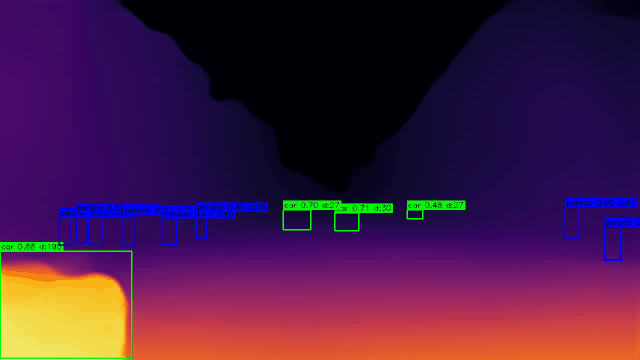
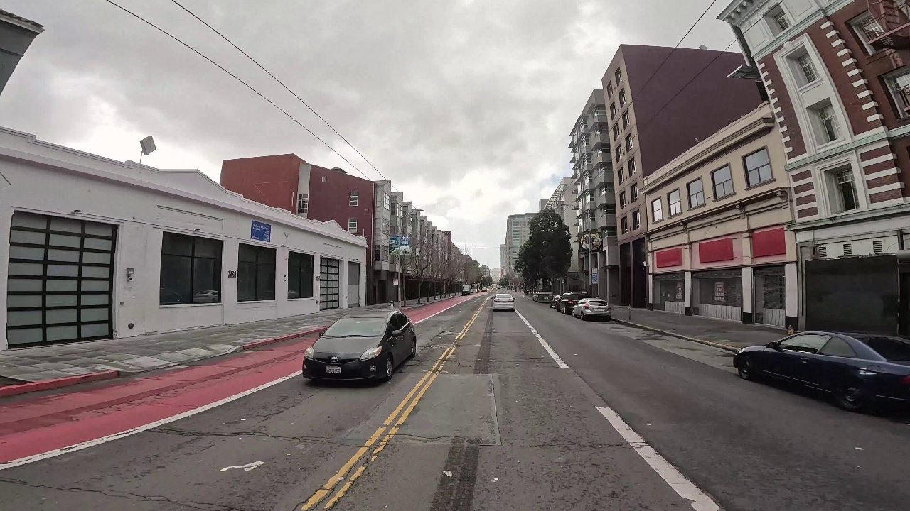
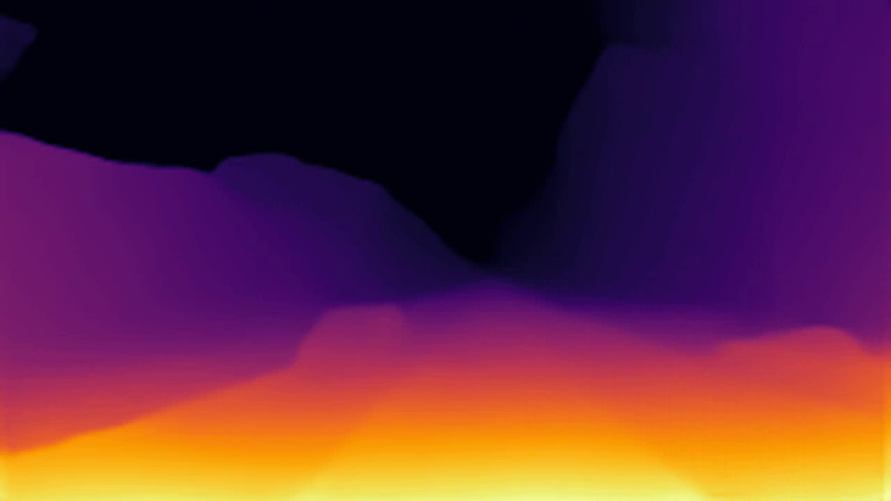
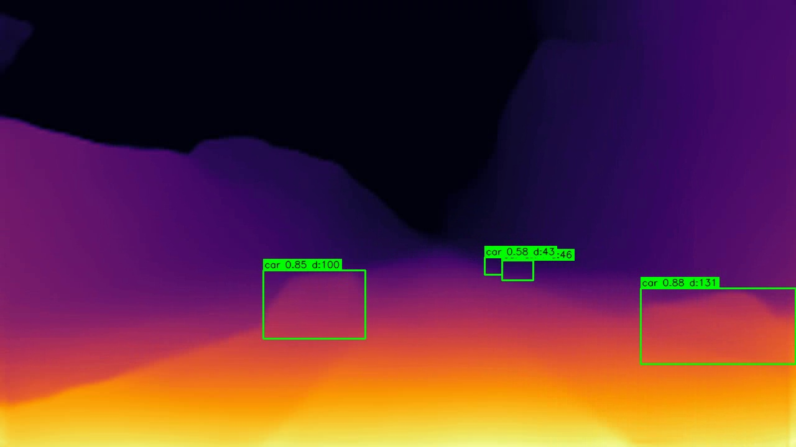
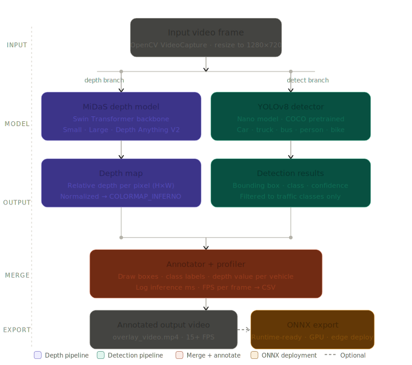

# Monocular Depth Estimation Pipeline

> Per-pixel depth estimation from traffic video using transformer-based models —
> with multi-model benchmarking, YOLO detection overlay, and ONNX export for deployment.


---

## Demo

<div align="center">



*Depth colormap with YOLO detections — each vehicle annotated with class, confidence, and estimated depth value.
Running at 15+ FPS on a GTX 1650.*

</div>

---

## What This Project Does

A single camera frame contains no explicit depth information — objects close and far project
onto the same 2D plane. This pipeline recovers per-pixel relative depth from monocular video
using transformer-based models, then combines that depth map with real-time object detection
to produce a scene understanding output where every detected vehicle has a depth context.

Three outputs are produced per run:

| Output | Description |
|---|---|
| `depth_video.mp4` | Colorized depth map video — warm pixels near, cool pixels far |
| `overlay_video.mp4` | Depth map with YOLO bounding boxes and per-vehicle depth values |
| `profiler_log.csv` | Per-frame inference time and FPS log |

---

## Input → Depth Map → Detection Overlay

<div align="center">

| Raw input | Depth map | Detection overlay |
|:---:|:---:|:---:|
|  |  |  |
| Original traffic video frame | Per-pixel relative depth (INFERNO colormap) | Depth + YOLO boxes with depth value per vehicle |

</div>

---

## Pipeline Architecture

<div align="center">



*Two-branch pipeline — depth estimation and object detection run on each frame,
results merge in the annotator to produce the final output.*

</div>

---

## How It Works — Technical Overview

### Monocular depth estimation

A single RGB image is geometrically ambiguous — the same 2D projection can come from
infinitely many 3D scenes. A small nearby object and a large distant object cast identical
pixel footprints. Monocular depth models resolve this ambiguity by learning statistical
priors from large datasets: objects lower in the frame tend to be closer, texture becomes
finer with distance, and known object categories (cars, people) provide implicit scale cues.

The output is **relative depth** — a per-pixel map encoding which surfaces are nearer or
farther relative to each other, not absolute metric distance in metres. Metric depth requires
either stereo cameras, LiDAR ground truth, or scale anchoring from known object sizes.

### MiDaS architecture

MiDaS (Mixed Dataset for zero-shot relative depth) uses a **DPT (Dense Prediction
Transformer)** architecture. A Vision Transformer or EfficientNet backbone extracts
multi-scale feature representations, which a decoder assembles into a full-resolution depth
map. Crucially, MiDaS was trained across a diverse mix of datasets with different capture
setups — enabling zero-shot generalization to unseen scenes without fine-tuning.

The small variant uses an EfficientNet-Lite3 backbone (fast, ~80MB). The large variant uses
a ViT-Large backbone (slow, accurate, ~1.3GB). Both produce relative inverse depth — closer
surfaces have higher values, which maps naturally to the bright end of the INFERNO colormap.

### Depth Anything V2

Depth Anything V2 extends the MiDaS philosophy with a much larger and more diverse training
set including synthetic data with metric labels. The Small variant (~100MB) achieves notably
sharper depth boundaries than MiDaS Small — especially around object edges and thin
structures — at the cost of higher inference latency on GPU.

### Why ONNX matters for automotive deployment

PyTorch is a research and training framework — it carries a large runtime footprint and
requires Python. Production perception systems on automotive SOCs (NVIDIA Jetson Orin,
TI TDA4VM, Qualcomm SA8295) run inference through lightweight C++ runtimes. ONNX
(Open Neural Network Exchange) is the standard interchange format: the model is exported
once from PyTorch, then executed by ONNX Runtime with hardware-specific execution providers
(CUDA, TensorRT, OpenVINO, DirectML). This is the required path from research to deployment
in real automotive stacks.

### Input resolution vs performance trade-off

Source video was 4K (3840×2160). Running depth inference at native 4K produced 4.68 FPS.
Resizing input to 1280×720 before inference improved this to 17.79 FPS — a 3.8× speedup —
with no meaningful loss in depth quality, since MiDaS internally processes at 256×256 or
384×384 regardless. This decouples pipeline performance from source resolution, which is
standard practice in real-time perception systems.

---

## Model Benchmark

All models benchmarked on GTX 1650 (4GB VRAM) at 1280×720 resolution.

| Model | Backend | Avg Inference | Avg FPS | Notes |
|---|---|---|---|---|
| MiDaS Small | PyTorch (CUDA) | 68 ms | 17.79 | Default — best speed |
| MiDaS Small | ONNX Runtime (CUDA) | 90 ms | 11.08 | Deployment-ready format |
| MiDaS Large | PyTorch (CUDA) | 564 ms | 1.77 | Highest accuracy |
| Depth Anything V2 | PyTorch (CUDA) | 243 ms | 4.11 | Best visual quality |
| Depth + YOLO overlay | PyTorch (CUDA) | 87 ms | 15.41 | Both models combined |

PyTorch and ONNX Runtime show similar GPU numbers because both bottleneck on GPU compute.
The ONNX advantage appears on CPU and embedded targets (Jetson, automotive SOCs) where
the full PyTorch stack is not available.

---

## Key Concepts at a Glance

| Concept | What it means here |
|---|---|
| Relative depth | Per-pixel near/far ordering — not metric metres |
| Zero-shot generalization | MiDaS runs on unseen traffic scenes without fine-tuning |
| DPT architecture | Transformer encoder + dense decoder for full-resolution prediction |
| INFERNO colormap | Yellow = near, purple/black = far — perceptually uniform |
| ONNX Runtime | Lightweight inference engine for embedded and automotive targets |
| Input resize | 4K → 720p before inference — 3.8× FPS gain, no quality loss |
| Overlay cost | Adding YOLO costs only ~19ms — both models share the GPU efficiently |

---

## Project Structure

```
monocular-depth-estimation/
│
├── src/
│   ├── depth_estimator.py    # MiDaS + Depth Anything V2 inference wrapper
│   ├── video_pipeline.py     # Frame-by-frame depth video pipeline
│   ├── overlay_pipeline.py   # Combined depth + YOLO detection pipeline
│   ├── detector.py           # YOLOv8 detection wrapper
│   ├── annotator.py          # Draw boxes, labels, depth values on frames
│   ├── profiler.py           # Per-frame FPS and inference time logger
│   ├── exporter.py           # ONNX export utility
│   └── onnx_estimator.py     # ONNX Runtime inference wrapper
│
├── configs/
│   └── default.yaml          # All settings — no hardcoded values
│
├── tests/
│   ├── test_depth_estimator.py
│   ├── test_annotator.py
│   └── test_profiler.py
│
├── docs/                     # Pipeline diagram, demo GIF, sample frames
├── outputs/                  # Generated videos and logs (gitignored)
├── data/                     # Input video (gitignored)
│
├── run_depth.py              # Main CLI entry point
├── run_benchmark.py          # Multi-model benchmark runner
├── run_onnx.py               # ONNX export + PyTorch vs ONNX comparison
├── make_gif.py               # Demo GIF generator
├── Dockerfile                # Reproducible inference container
└── .github/workflows/ci.yml  # GitHub Actions — runs tests on every push
```

---

## Setup

```bash
git clone https://github.com/SHIVCHAUDHARY17/Monocular-Depth-Estimation.git
cd Monocular-Depth-Estimation

python -m venv venv
venv\Scripts\activate          # Windows
source venv/bin/activate        # Linux / Mac

pip install torch torchvision --index-url https://download.pytorch.org/whl/cu121
pip install -r requirements.txt
```

Place your input video at `data/test_video.mp4`.

---

## Usage

```bash
# Depth map on a single image
python run_depth.py --mode image

# Depth map video
python run_depth.py --mode video

# Depth + YOLO detection overlay video
python run_depth.py --mode overlay

# Benchmark all three models
python run_benchmark.py --frames 50

# Export to ONNX and compare backends
python run_onnx.py --frames 50
```

---

## Configuration

All parameters live in `configs/default.yaml` — nothing is hardcoded.

```yaml
model:
  name: midas_small      # midas_small | midas_large | depth_anything
  device: cuda           # cuda | cpu

video:
  resize_width: 1280
  resize_height: 720

detector:
  weights: yolov8n.pt
  confidence: 0.3

output:
  colormap: COLORMAP_INFERNO
```

---

## Testing and CI

```bash
pytest tests/ -v
```

16 unit tests across depth estimator logic, annotator, and profiler.
GitHub Actions runs the full test suite on every push automatically.

---

## Docker

```bash
docker build -t monocular-depth .
docker run --rm -v "${PWD}:/app" monocular-depth
```

---

## Limitations

- Depth output is relative, not metric — no absolute distance in metres
- Model has no temporal memory — each frame is processed independently
- ONNX and PyTorch show similar GPU latency since both bottleneck on GPU compute;
  ONNX advantage is on CPU and embedded targets
- No stereo validation or ground truth depth evaluation

---

## Future Work

- Temporal smoothing across frames (exponential moving average on depth maps)
- Quantitative evaluation on KITTI using AbsRel and RMSE metrics
- TensorRT optimization for sub-10ms inference on Jetson
- ROS 2 node wrapping the depth + detection pipeline

---

## What This Project Demonstrates

- Transformer-based monocular depth estimation on real traffic video
- Multi-model benchmarking across speed and quality trade-offs
- Combined depth + detection pipeline running at 15+ FPS on a GTX 1650
- ONNX export and Runtime inference for deployment-aware engineering
- Modular Python architecture with config-driven settings, pytest, and CI

---

## Author

**Shiv Jayant Chaudhary** — Computer Vision and Machine Learning Engineer

[](https://linkedin.com/in/shiv1716)
[](https://github.com/SHIVCHAUDHARY17)
